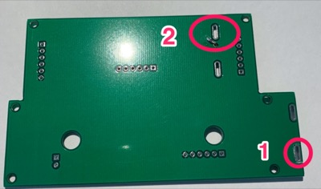
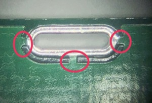
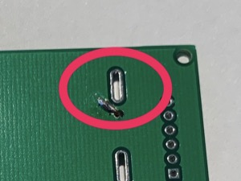
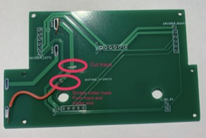
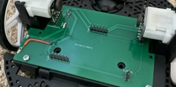
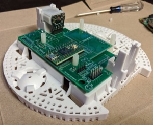

## Version 1 rework

V1.0 of this design has one design error.  If you make new boards, please use the corrected version (V1.1).  The intial run of PCBs from V1.0 can be identified by the number 3047184E_Y8-200715 on them.  These board need the following rework to correct swicth the positive and negative battery terminals, which were incorrectly connected.
  - All the rework is on the bottom board.  The correct polarity for the battery tabs is as shown: ! [terminals](terminals.jpeg)
  - The two battery tab slots indicated need to be modified:  
  
  - Slot 1 needs to be disconnected from the ground plane by cutting the three small traces connected to it:  
 
  - Drill a small hole through the board near Slot 2, scrape the solder mask off of a neighboring patch, solder a wire to the exposed ground plane and feed the wire through the hole and position it next to Slot 2 on the top side of the board:  
  
  - On the top side of the board, cut the trace, scrape the solder mask off the trace and solder a wire onto the trace as shown:  
  
  - Position both wires next to the appropriate slots as shown above and solder the wires to the battery tabs when those tabs are inserted into the slots during the assembly.

## Assembly Notes

- In general, follow the instructions in the Romi chassis assembly [guide](https://www.pololu.com/docs/0J68/4).  Note that wheel encoders should be installed as shown in those instructions and will plug into the bottom board.
- The [interactive BOM](https://htmlpreview.github.io/?https://github.com/portlandrobotics/common_platform/blob/master/hardware/romi_board/bom/ibom.html) is helpful while soldering components onto the board.
- We recommend using headers between the boards so that disassembly is possible.  Use female (socket) header on the bottom board and male (pin) headers on top board.  Pin headers come with all of the breakout boards.  
 
- Use the top board to guide breakout board header soldering.  Insert the pin headers into the appropriate positions on the top board and then add the breakout boards onto the pins and solder them to the breakout boards. 
We recommend using socket headers on the top board for all of the breakout board positions so that they can be plugged in- Brace the IMU with extra header or cardboard or some other means.  Shown below is a 3D printed block but anything of the appropriate size will do.  

- The three pin header on the motor driver is not needed and can be left without header pins.
- Pay attention to the orientation of the MOSFETs
- Use 2M ohm resistor for the battery voltage resistor divider (R1) if you use the 6 AA batteries.  If you use higher voltage batteries (2 LiPo batteries for example) then use a 3M ohm resistor.
- Cut trace on teensy for battery power.  See the note "Cut to separate VIN from VUSB" on the "Teensy 4.0 Back Side" image on this [page](https://www.pjrc.com/store/teensy40.html).
- If you want to mount a Raspberry Pi on the robot, this is how to use standoffs to do so:  
